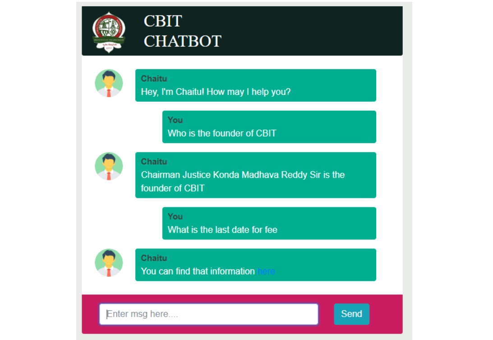

# CBIT Chatbot

This project introduces a domain specific chatbot exclusive to the educational institution CBIT
(Chaitanya Bharathi Institute of Technology) which aims to to answer and resolve queries regarding the previous, current, and upcoming happenings of the institution. We used the flask framework and the chatterbot module of python for this project.

## How to Run

> Download/clone the repository\
> cd cbit-Chatbot\
> Create a virtual environment venv\
> run venv/scripts/activate\
> run python -m pip install flask\
> run python -m pip install chatterbot\
> run python -m pip install chatterbot-corpus\
> run python -m pip install chatterbot\
> run python -m pip install pytz\
> run python -m pip install python-dateutil\
> run python -m pip install nltk\
> run python -m nltk.downloader all\
> run python -m flask run\

## Output

